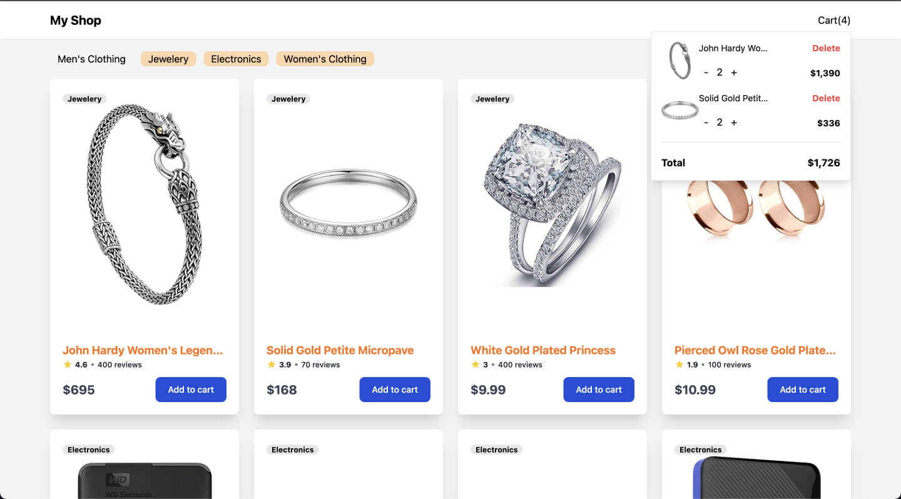

# วิธีการส่งข้อสอบ
1. อัพ Code ขึ้น GitHub ของตัวเอง
2. Deploy Code ขึ้น Hosting ที่ไหนก็ได้
3. ส่ง Link GitHub และ Link Website ที่อัพขึ้น Hosting แล้วมาทาง **Email: suphakon@owldayhouse.com**

# Frontend
- สามารถใช้ Vue, React, Angular, Svelte หรือ Framework ใดๆ ในการสอบก็ได้
- สามารถใช้ CSS Framework หรือจะ custom CSS เองก็ได้

## Requirement
สร้าง Product Listing Page ขึ้นมาตาม Requirement ดังนี้
1. Render data from API
2. Filter product by ```category```
2. Manage product in cart
- ** หมายเหตุ ไม่จำเป็นต้องทำเหมือนกับข้อสอบ เป็นเพียงแค่แนวทางในการวาง layout เท่านั้น ```สามารถออกแบบใหม่ได้ทั้งหมด```
 
## 1. Render data from API
- ### นำข้อมูลจาก https://fakestoreapi.com/products มาแสดงผลดังนี้
  

- ### สร้าง skeleton loader ขึ้นมาเมื่อข้อมูลมีการ fetching
  

## 2. Filter product by category
- ### เมื่อเลือก category ไหนบ้างก็ให้แสดงสินค้าตามที่เลือก หากไม่มีการเลือก category ไหนเลยก็ให้แสดงสินค้าทั้งหมด
  

## 3. Manage product in cart
- ### สามารถจัดการสินค้าที่อยู่ในรถเข็นได้ 
  

## Deployment
- หากทำบททดสอบเสร็จแล้วให้เอาขึ้นไปยัง Github ของตัวเอง ตั้ง Repository เป็น Public ด้วย
- Deploy application ขึ้นไปยัง Hosting ใดก็ได้ แนะนำผู้ให้บริการตามด้านล่าง
  - Github Page
  - Firebase Hosting
  - Vercel
  - Netlify
  - Heroku
